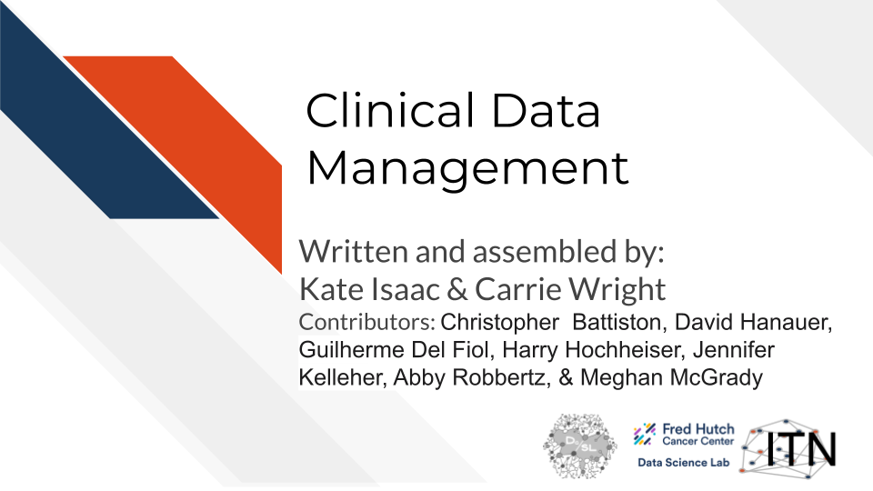
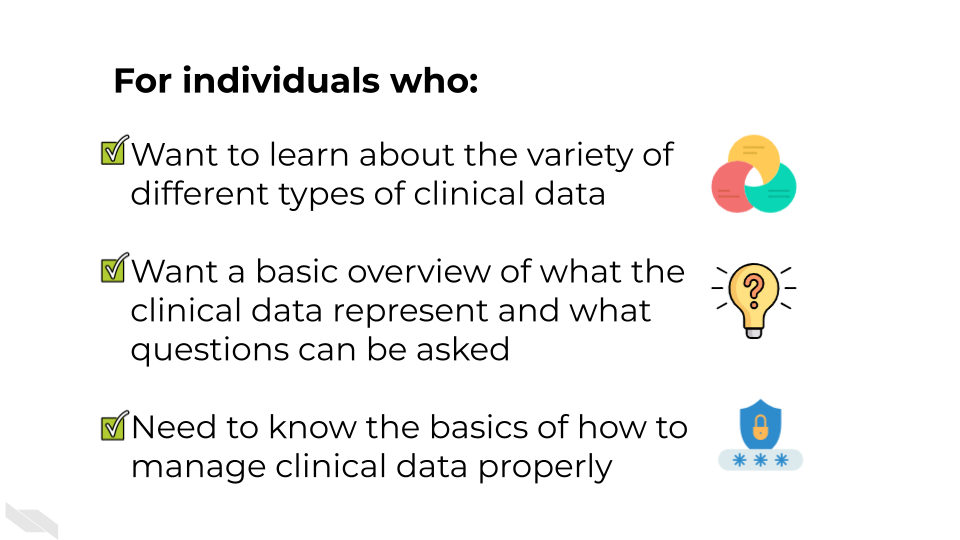
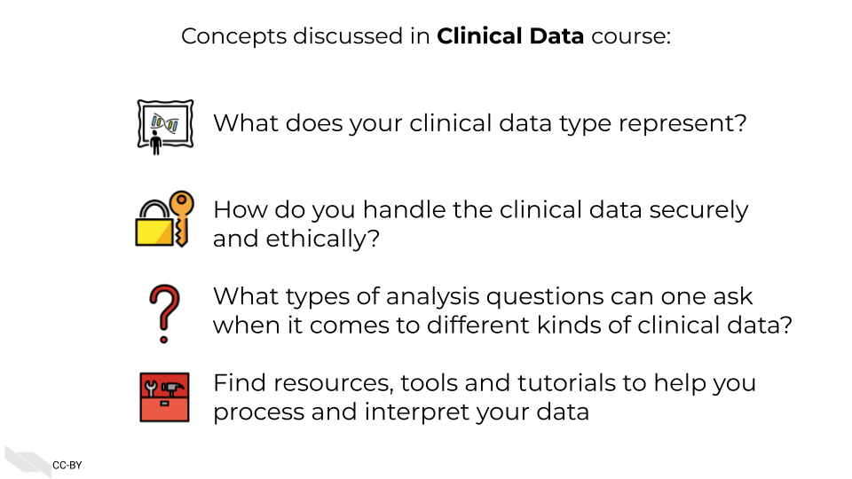
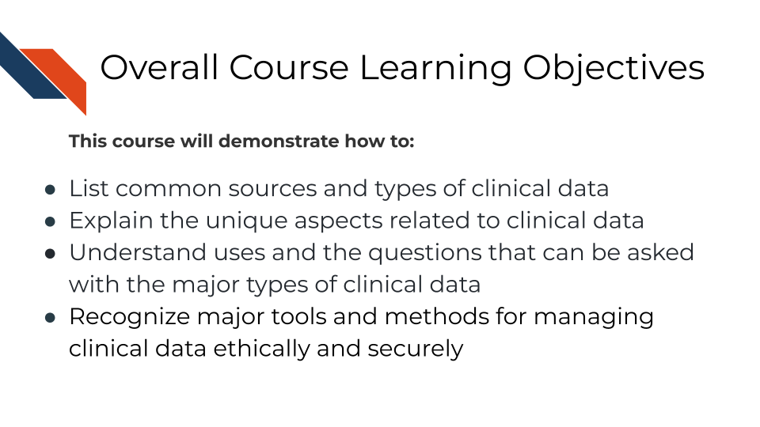

# Introduction

## Motivation

This course is intended for researchers (including postdocs and students) with limited to intermediate experience with informatics research. The conceptual material will also be useful for those in management roles who are collecting data and using informatics pipelines. 

This course is intended to provide an overview of the different kinds of data commonly used in clinical research, the questions that can typically be asked with such data, as well as guidance for how to manage this data.

## Topics Covered

## Curriculum 

The course will cover key underlying principles and concepts in ethical data handling. 

